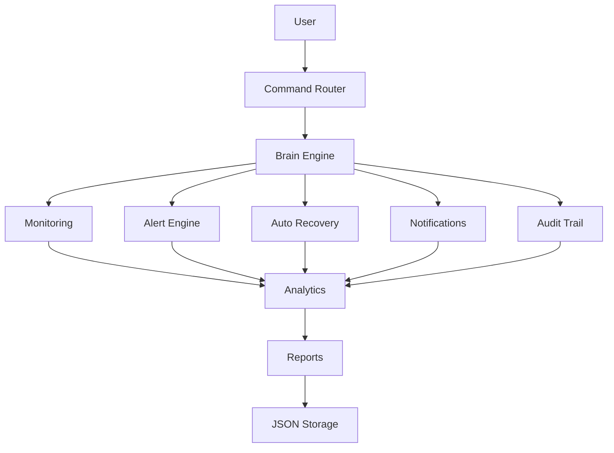

# SentinelOps

SentinelOps is a Python-based observability and infrastructure monitoring platform designed to monitor system health, analyze operational stability, track incidents, generate predictive alerts, and perform autonomous service recovery.

The project simulates real-world observability and DevOps concepts including telemetry collection, incident lifecycle management, health scoring, trend analysis, operational reporting, and self-healing infrastructure workflows.

SentinelOps was built as a practical infrastructure engineering project focused on Linux administration, RHCSA preparation, observability engineering, and infrastructure automation learning.


## Features

* Infrastructure Monitoring

* Service Monitoring

* Incident Management

* Autonomous Recovery

* Audit & Notification System

* Operational Analytics

* Reporting & Export

* Predictive Intelligence

* Persistence


## Architecture

SentinelOps is designed using a modular infrastructure-oriented architecture where different components handle monitoring, analytics, incident management, automation, and operational reporting responsibilities.

### Core Components

```text

Components        Responsibility

brain.py	  Monitoring engine, analytics, service recovery, reporting

main.py           Application entry point and command loop

commands.py	  CLI command routing

logger.py	  Operational logging

memory.py	  Persistent knowledge storage

nlp.py	          Natural language command translation

utils.py	  Shared helper functions

config.json 	  Monitoring thresholds and policies

alerts.json       Active alert persistence

audit_trail.json  Persistent audit events

notification.json Persistent notification history

memory.json 	  Knowledge base storage

```


### Operational Flow



### Monitoring Capabilities

* CPU usage monitoring
* Memory utilization tracking
* Disk usage monitoring
* Critical service monitoring
* Telemetry history collection
* Health trend analysis
* Predictive infrastructure alerting

### Reliability & Remediation

* Structured incident lifecycle tracking
* Active and resolved incident management
* Autonomous service recovery workflows
* Controlled remediation policies
* Persistent operational reporting


## Operational Workflow

```text

Service Failure
        │
        ▼
SentinelOps detects unhealthy service
        │
        ▼
Incident is recorded
        │
        ▼
Critical notification generated
        │
        ▼
Automatic recovery initiated
        │
        ▼
Recovery status verified
        │
        ▼
Audit trail updated
        │
        ▼
Reliability analytics updated
        │
        ▼
Operational report available

```

### Example Scenario

1. nginx service unexpectedly stops.
2. SentinelOps detects the unhealthy service.
3. A critical notification is generated.
4. An audit event is recorded.
5. Automatic recovery is attempted.
6. Service health is verified.
7. Recovery statistics are updated.
8. The incident appears in operational reports.


## Available Commands

```text

/dashboard  	    Display centralized infrastructure dashboard

/telemetry  	    Show telemetry history for CPU, memory, and disk

/alerts     	    Display active operational incidents

/incidentstats	  Show active incident analytics

/resolvedstats	  Show resolved incident analytics

/average cpu	    Display average CPU utilization

/peak cpu	        Display peak CPU usage

/stability cpu	  Analyze CPU stability trends

/service nginx	  Check service operational status

/recover nginx	  Attempt autonomous service recovery

/report           Generate operational infrastructure report

/savereport	      Export persistent operational report

/kill process	    Terminate non-protected processes safely

/exit	            Shut down SentinelOps monitoring system

```

Example Usage:

```text

>>> /dashboard
>>> /report
>>> /recover nginx
>>> /service apache
>>> /savereport

```


## Technologies Used

* Python
* psutil
* threading
* JSON persistence
* File handling
* CLI-based architecture
* Infrastructure monitoring concepts
* Observability engineering concepts
* Incident lifecycle management
* Predictive operational analytics

## Future Improvements

* Linux-native service management using `systemctl`
* Flask-based web dashboard
* Docker container monitoring
* Real-time log analysis
* Email alert integration
* Database-backed incident storage
* Multi-node infrastructure monitoring
* Grafana-style visualization interface
* SSH-based remote infrastructure monitoring
* Authentication and role-based access control

## Project Goals

SentinelOps was developed as a practical infrastructure engineering and observability learning project focused on:

* RHCSA preparation
* Linux administration
* DevOps foundations
* Infrastructure automation
* Observability engineering
* Reliability engineering concepts
* Backend systems thinking

## Author

Developed as a hands-on infrastructure monitoring and observability platform project for practical systems engineering learning and portfolio development.

