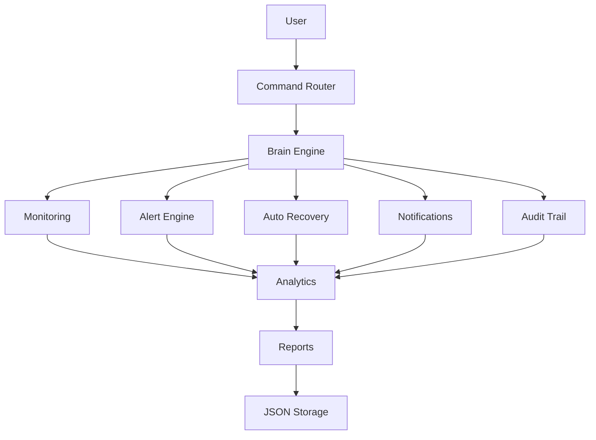

# SentinelOps

SentinelOps is a Python-based observability and infrastructure monitoring platform designed to monitor system health, analyze operational stability, track incidents, generate predictive alerts, and perform autonomous service recovery.

The project simulates real-world observability and DevOps concepts including telemetry collection, incident lifecycle management, health scoring, trend analysis, operational reporting, and self-healing infrastructure workflows.

SentinelOps was built as a practical infrastructure engineering project focused on Linux administration, RHCSA preparation, observability engineering, and infrastructure automation learning.


## Features

### Infrastructure Monitoring
- Real-time CPU, memory, and disk monitoring
- Critical Linux service monitoring
- Operational health scoring

### Service Monitoring
- Monitor critical system services
- Service health analysis
- Runtime and resource inspection

### Incident Management
- Active and resolved incident tracking
- Incident lifecycle management
- Persistent incident history

### Autonomous Recovery
- Automatic service restart
- Recovery verification
- Controlled recovery policies

### Audit & Notification System
- Persistent audit trail
- Critical and informational notifications
- Recovery event logging

### Operational Analytics
- Reliability analytics
- Recovery success rate
- Most unstable service detection
- Health trend analysis

### Reporting & Export
- Operational report generation
- Report export
- Recent audit and notification summaries

### Predictive Intelligence
- Infrastructure trend analysis
- Predictive health status

### Persistence
- JSON-based persistent storage
- Configuration-driven monitoring


## Architecture

SentinelOps is designed using a modular infrastructure-oriented architecture where different components handle monitoring, analytics, incident management, automation, and operational reporting responsibilities.

### Core Components

```text
Components        Responsibility

brain.py	  Monitoring engine, analytics, service recovery, reporting

main.py           Application entry point and command loop

commands.py	  CLI command routing

logger.py	  Operational logging

memory.py	  Persistent knowledge storage

nlp.py	          Natural language command translation

utils.py	  Shared helper functions

config.json 	  Monitoring thresholds and policies

alerts.json       Active alert persistence

audit_trail.json  Persistent audit events

notification.json Persistent notification history

memory.json 	  Knowledge base storage
```


### Operational Flow



### Monitoring Capabilities

* CPU usage monitoring
* Memory utilization tracking
* Disk usage monitoring
* Critical service monitoring
* Telemetry history collection
* Health trend analysis
* Predictive infrastructure alerting

### Reliability & Remediation

* Structured incident lifecycle tracking
* Active and resolved incident management
* Autonomous service recovery workflows
* Controlled remediation policies
* Persistent operational reporting


## Operational Workflow

```text
Service Failure
        │
        ▼
SentinelOps detects unhealthy service
        │
        ▼
Incident is recorded
        │
        ▼
Critical notification generated
        │
        ▼
Automatic recovery initiated
        │
        ▼
Recovery status verified
        │
        ▼
Audit trail updated
        │
        ▼
Reliability analytics updated
        │
        ▼
Operational report available
```

### Example Scenario

1. nginx service unexpectedly stops.
2. SentinelOps detects the unhealthy service.
3. A critical notification is generated.
4. An audit event is recorded.
5. Automatic recovery is attempted.
6. Service health is verified.
7. Recovery statistics are updated.
8. The incident appears in operational reports.


## Installation

### Prerequisites

Before running SentinelOps, ensure your system meets the following requirements:

- Linux operating system (Recommended: Rocky Linux, RHEL, Fedora, Ubuntu)
- Python 3.10 or later
- `systemd` service manager
- Sudo privileges (required for automatic service recovery)

---

### Clone the Repository

```bash
git clone https://github.com/rajwakarekar7/SentinelOps.git

cd SentinelOps
```

---

### Install Dependencies

Install the required Python packages:

```bash
pip install -r requirements.txt
```

---

### Configure Sudo Permissions

SentinelOps monitors and manages Linux services using `systemctl`.

To enable automatic service recovery, run SentinelOps with appropriate sudo privileges or configure passwordless sudo for the required `systemctl` commands.

---

### Run SentinelOps

Start the application:

```bash
python main.py
```

After startup, you should see the SentinelOps banner and command prompt.

---

### Verify Installation

Run a few commands to verify the installation:

```text
>>> /dashboard
>>> /services
>>> /service nginx
>>> /monitor
>>> /report
```

If these commands execute successfully, SentinelOps is ready to monitor your Linux system.

## Quick Start

The following workflow demonstrates the complete SentinelOps monitoring lifecycle.

### 1. View the System Dashboard

```text
>>> /dashboard
```

Displays the current system health, resource utilization, monitored services, and operational status.

---

### 2. Start Background Monitoring

```text
>>> /monitor
```

Starts continuous monitoring of configured Linux services.

---

### 3. Simulate a Service Failure

Open another terminal and stop a monitored service:

```bash
sudo systemctl stop nginx
```

SentinelOps automatically detects the unhealthy service and attempts recovery.

---

### 4. Review Notifications

```text
>>> /notifications
```

Displays generated operational notifications, including service failures and recovery events.

---

### 5. Review the Audit Trail

```text
>>> /audit
```

Displays a chronological history of operational events.

---

### 6. Generate an Operational Report

```text
>>> /report
```

Generates a complete operational report containing:

- System health
- Reliability analytics
- Recent audit events
- Recent notifications

---

### 7. Export the Report

```text
>>> /savereport
```

Exports the operational report for future reference.

## Available Commands

### System Monitoring

```text
/dashboard            Display centralized infrastructure dashboard
/live                 Start live system monitoring
/telemetry            Show CPU, memory, and disk telemetry history
/average cpu          Display average CPU utilization
/peak cpu             Display peak CPU usage
/stability cpu        Analyze CPU stability trends
```

### Service Management

```text
/services             Display status of monitored services
/service nginx        Show detailed service information
/monitor              Start background service monitoring
/recover nginx        Restart a service manually
/kill <service>         Safely terminate a non-protected process
```

### Incident & Reliability

```text
/alerts               Display active alerts
/incidentstats        Show active incident statistics
/resolvedstats        Show resolved incident statistics
/audit                Display audit trail
/reliability          Show service reliability analytics
/recoveryrate         Display recovery success rate
/notifications        Show notification history
```

### Reporting

```text
/report               Generate operational report
/savereport           Export report to file
```

### System

```text
/exit                 Shut down SentinelOps
```

Example Usage:

```text
>>> /dashboard
>>> /report
>>> /recover nginx
>>> /service apache
>>> /savereport
```

## Technologies Used

### Programming Language

- Python 3

### Libraries

- psutil
- threading

### Platform

- Linux
- systemd
- CLI

### Concepts

- Infrastructure Monitoring
- Observability
- Incident Management
- Reliability Engineering


## Skills Demonstrated

```text
• Linux System Administration
• Service Management (systemd)
• Infrastructure Monitoring
• Observability Engineering
• Incident Lifecycle Management
• Self-Healing Automation
• Multithreading
• JSON Persistence
• CLI Application Development
• Operational Reporting
```


## Future Improvements
```text
Web-based dashboard
REST API
Email/Slack notifications
Docker/Kubernetes monitoring
Prometheus integration
```

## Project Goals

SentinelOps was developed as a practical infrastructure engineering and observability learning project focused on:

* RHCSA preparation
* Linux administration
* DevOps foundations
* Infrastructure automation
* Observability engineering
* Reliability engineering concepts
* Backend systems thinking

## Author

Developed by Rajvardhan Vakarekar as part of a hands-on Linux System Administration, RHCSA preparation, and Infrastructure Engineering learning journey.

The project focuses on applying practical DevOps, observability, and reliability engineering concepts through real-world system monitoring and self-healing workflows.


